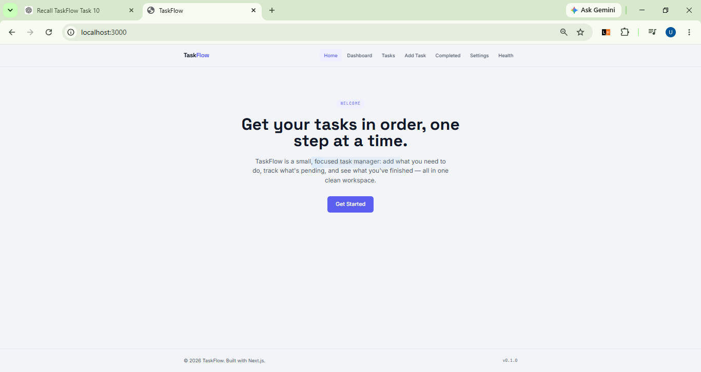
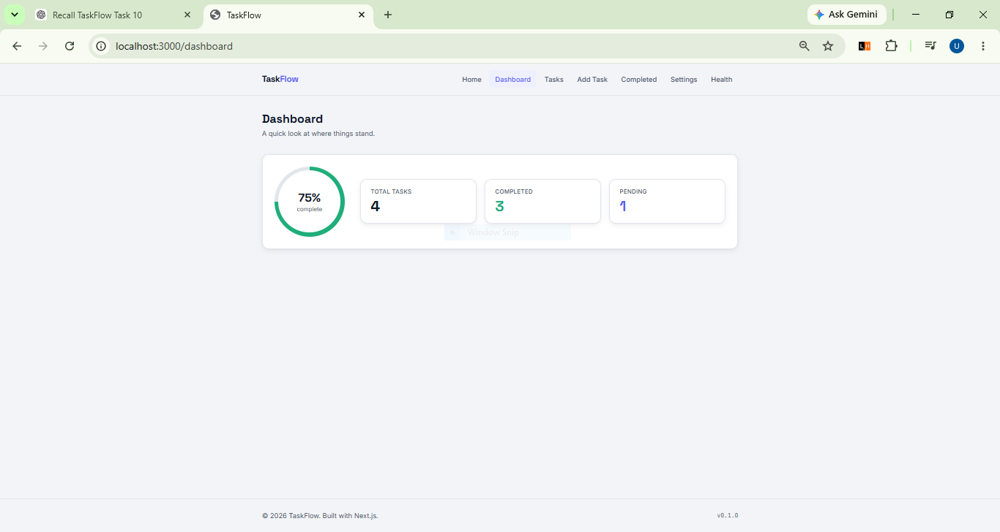
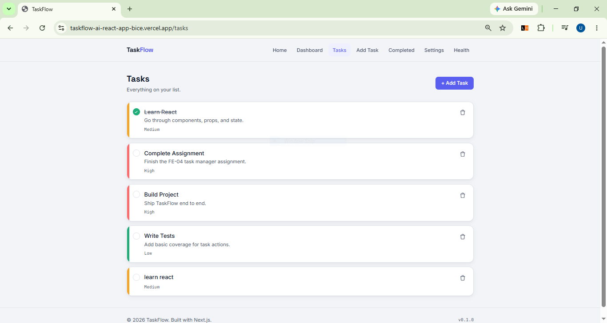
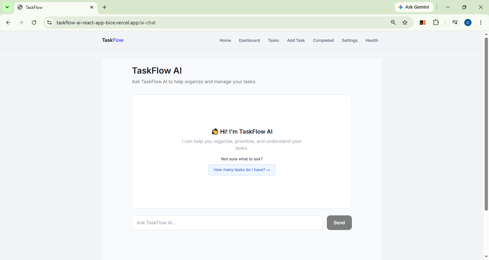
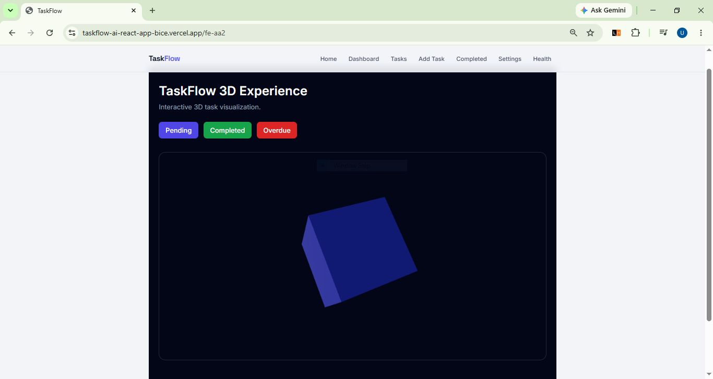
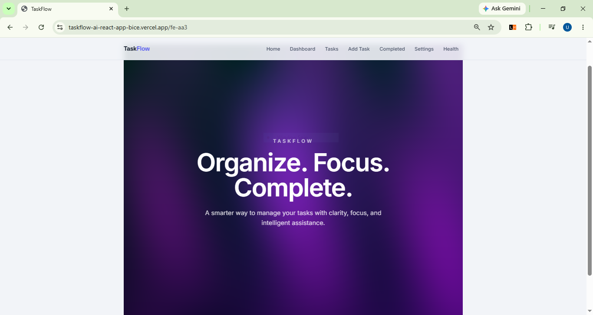

# TaskFlow
TaskFlow is a simple task management web application built with Next.js, React, and Tailwind CSS. It allows users to create, manage, and track tasks through a clean and responsive interface.
The project was developed as part of the FlyRank Front-End AI Engineering Internship.


## Tech Stack
* **Framework:** Next.js
* **Library:** React
* **Styling:** Tailwind CSS
* **Language:** JavaScript
* **State Management:** React Context API
* **Storage:** Browser localStorage
* **3D:** Three.js and React Three Fiber
* **AI:** Vercel AI SDK and OpenRouter
* **Deployment:** Vercel


## Features
* Create and manage tasks
* Mark tasks as completed
* Delete tasks
* Set task priority and deadline
* View task progress on the dashboard
* Store tasks using localStorage
* Responsive design for desktop and mobile
* Dark mode
* Health check page and API
* AI chat for viewing task statistics
* Interactive 3D task visualization
* Fullscreen WebGL shader hero


## FE-AA2 — 3D Web Experience
A separate 3D experience was added to TaskFlow at:
```text
/fe-aa2
```
The page uses Three.js with React Three Fiber to display an interactive 3D cube representing task status.


### 3D Interactions
The user can select different task statuses:
* **Pending** — Indigo
* **Completed** — Green
* **Overdue** — Red
Changing the status changes the color of the 3D cube.
The cube can also be rotated and zoomed using the available controls.
The 3D experience is kept simple by using a basic cube instead of a large 3D model. This helps keep the page lightweight and easier to use on different devices.


## FE-AA3 — Fullscreen Shader Hero
A fullscreen WebGL shader hero was added to TaskFlow at:
```text
/fe-aa3
```
The page uses a custom GLSL shader rendered through WebGL. The shader uses animation and mouse interaction to create a fullscreen visual experience.
The implementation includes:
* `u_time` for animation
* `u_resolution` for responsive rendering
* `u_mouse` for mouse interaction
* Aspect-ratio correction
* Layered sine-wave effects
* Central glow
* Mouse-following glow
* Device-pixel-ratio handling
* Reduced-motion support
* Visibility handling to pause animation when the tab is hidden
The shader is implemented without relying on a large external 3D model.


## Screenshots
### Home


### Dashboard


### Tasks


### AI Chat


### FE-AA2 — 3D Experience


### FE-AA3 — Fullscreen Shader Hero



## Performance
The application was tested using the production build:
```bash
npm run build
```
The production build completed successfully with all application routes included.
The FE-AA2 page uses a simple 3D object instead of a large external model to keep the experience lightweight.
The FE-AA3 shader also uses performance-conscious techniques such as a maximum device pixel ratio and pausing animation when the browser tab is hidden.
The final Lighthouse Mobile audit recorded:
* **Performance:** 80
* **Accessibility:** 95
Accessibility testing also included WAVE checks and keyboard-only navigation.

One concrete improvement made during the accessibility and performance work was improving the AI Chat interface for keyboard and accessibility support and investigating performance issues through Lighthouse.


## Future Improvements
With more time, the application could be improved by:
* Adding a backend database for persistent task storage
* Adding user authentication
* Synchronizing tasks across devices
* Adding more detailed 3D task visualizations
* Adding animations when task status changes
* Adding more visual effects and lighting
* Improving the 3D experience for different mobile devices
* Connecting the 3D visualization directly with actual tasks
* Adding persistent per-user API rate limiting


## Known Limitations
* Task data is stored locally in the browser and is not synchronized across devices.
* AI functionality depends on the configured OpenRouter API key and external model availability.
* The current API protection uses request and message limits rather than persistent per-user rate limiting.
* The application does not currently have user authentication.
* The application does not currently use a backend database for task storage.


## Run Locally
Clone the repository and install the required packages:
```bash
cd taskflow
npm install
npm run dev
```
Then open:
```text
http://localhost:3000
```
The 3D experience can be opened at:
```text
http://localhost:3000/fe-aa2
```
The fullscreen shader experience can be opened at:
```text
http://localhost:3000/fe-aa3
```


## Environment Variables
TaskFlow uses an environment variable for the AI chat feature.
Create a `.env.local` file in the project root:
```env
OPENROUTER_API_KEY=your_openrouter_api_key
```
The API key should not be committed to the repository.


## Main Pages
* **Home** — Introduction to TaskFlow
* **Dashboard** — Shows task statistics and progress
* **Tasks** — View, complete, and delete tasks
* **Add Task** — Create a new task
* **Completed Tasks** — View completed tasks
* **Settings** — Application settings
* **Health** — Application health check
* **AI Chat** — Interact with the AI task statistics feature
* **FE-AA1** — Button interaction and animation demo
* **FE-AA2** — Interactive 3D experience
* **FE-AA3** — Fullscreen WebGL shader hero


## How Task Data Works
Task data is managed using React Context API in:
```text
context/TaskContext.jsx
```
The task list is stored in the browser's localStorage. This allows tasks to remain available when moving between different pages of the application without requiring a separate database.


## AI Task Statistics
TaskFlow includes an AI feature that can provide task statistics.
The `getTaskStats` tool returns:

```js
{
  total: number,
  completed: number,
  pending: number,
  completionRate: number
}
```
For example, a user can ask:
> "How many tasks do I have?"
The AI can use the task statistics feature to provide the current task counts.
For task-statistics questions, the AI is instructed to use the `getTaskStats` tool before answering. This allows the response to use the actual task data instead of inventing task statistics.


## AI Integration
TaskFlow uses an LLM through OpenRouter and the Vercel AI SDK.
The AI feature is designed around the task-management use case rather than being only a general-purpose chatbot. Users can ask questions about their tasks, including task counts, completed tasks, pending tasks, and task progress.
For task-statistics questions, the model is instructed to use the `getTaskStats` tool first. The tool returns the current task statistics, which are then used to generate the response.
The system prompt also instructs the AI to provide clear, concise, and practical answers related to task management.


## Architecture Overview
TaskFlow is built using Next.js and React.
* The UI is built with Next.js App Router and React.
* Task data is managed using React Context API.
* Tasks are stored in browser localStorage.
* The AI Chat page communicates with the `/api/chat` route.
* The `/api/chat` route uses the Vercel AI SDK to stream responses.
* OpenRouter is used as the AI model provider.
* The `getTaskStats` tool provides task statistics to the AI.
* The application is deployed to Vercel.


### AI Request Flow
```text
User
  ↓
AI Chat UI
  ↓
/api/chat
  ↓
Input validation and request limits
  ↓
OpenRouter
  ↓
AI model
  ↓
Streaming response
  ↓
AI Chat UI
```


## API Protection
The AI chat API includes production safeguards to reduce unnecessary or abusive API usage.
The current implementation includes:
* Request body size limit
* Maximum message count
* Streaming execution timeout
* Invalid request handling
The `/api/chat` route uses a maximum streaming execution duration of 30 seconds.
These safeguards reduce the risk of unnecessarily large requests or excessively long AI requests consuming API resources.
Persistent per-user rate limiting is not currently implemented.


## Testing
The project uses Vitest and React Testing Library for component testing.
The existing test suite includes:
* 2 test files
* 4 passing tests
The production build was also verified using:
```bash
npm run build
```
The production build completed successfully with all application routes included.


## Deployment & Operation
TaskFlow is deployed to Vercel from the `main` branch.


### Production Checklist
* Production build verified using `npm run build`
* Environment variable configured for AI functionality
* Production URL verified
* AI Chat route implemented and tested
* FE-AA2 route included
* FE-AA3 route included
* Error handling implemented for invalid AI requests
* AI request body size limit configured
* Maximum message count configured
* Streaming execution timeout configured
* Git changes committed and pushed to the `main` branch


### Failure Handling
The AI API returns an error response when an invalid request is received or when an unexpected server-side error occurs.
The API also limits request size and message count and has a maximum streaming execution duration.
These safeguards help prevent invalid or unnecessarily large requests from being processed indefinitely.


### Rollback Plan
If a production deployment introduces a problem, the previous known-good Git commit can be redeployed through Vercel.
The `main` branch is used as the source for the production deployment, and Git history provides previous commits that can be used for rollback.


## Project Structure
```text
app/
├── page.js
├── dashboard/page.js
├── tasks/page.js
├── add-task/page.js
├── completed/page.js
├── settings/page.js
├── health/page.js
├── ai-chat/page.jsx
├── fe-aa1/page.jsx
├── fe-aa2/
│   ├── page.jsx
│   └── ThreeScene.jsx
├── fe-aa3/
│   └── page.jsx
├── api/
│   ├── chat/
│   │   └── route.js
│   └── health/
│       └── route.js
├── layout.js
└── globals.css

components/
├── Navbar.jsx
├── Footer.jsx
├── TaskCard.jsx
├── TaskForm.jsx
└── DashboardCard.jsx

context/
└── TaskContext.jsx

public/
└── screenshots/
    ├── ai-chat.PNG
    ├── dashboard.PNG
    ├── fe-aa2.PNG
    ├── fe-aa3.PNG
    ├── home.PNG
    └── tasks.PNG
```


## Development
The project was developed using an AI-assisted workflow.
AI tools were used to help with:
* Understanding Next.js and React concepts
* Debugging development issues
* Improving components and UI
* Writing and improving tests
* Exploring Three.js and React Three Fiber
* Exploring WebGL and GLSL shader implementation
* Reviewing implementation and documentation
The implementation and testing were done as part of the development process.
AI assistance was used as a development aid, while the resulting implementation was tested and reviewed during the project workflow.
Additional project documentation:
* `AI_PROMPTS.md`
* `AI_ASSISTANCE.md`
* `MANUAL_IMPROVEMENTS.md`


## Live Demo
Main application:
https://taskflow-ai-react-app-d8p1.vercel.app/
FE-AA2:
https://taskflow-ai-react-app-d8p1.vercel.app/fe-aa2
FE-AA3:
https://taskflow-ai-react-app-d8p1.vercel.app/fe-aa3


## Repository
GitHub:
https://github.com/UnnatiAgarwal08/taskflow-ai-react-app


## Deployment
The project is deployed using Vercel.
Basic deployment process:
1. Push the project to GitHub
2. Connect the repository to Vercel
3. Select the Next.js project
4. Configure the required environment variable
5. Deploy the application
6. Verify the production routes


## License
This project was developed as part of the FlyRank Front-End AI Engineering Internship.
